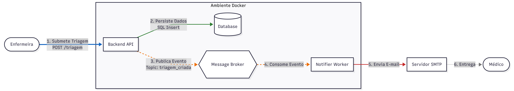

# 🏥 Ecossistema Prioritas

O Prioritas é um ecossistema de triagem médica projetado para automatizar e otimizar o processo de avaliação de risco do paciente e alertas médicos. Utiliza uma arquitetura de microsserviços para garantir escalabilidade, resiliência e uma clara separação de responsabilidades.

## 🏗️ Estrutura do Projeto

Este repositório é um monorepo contendo os seguintes subprojetos:

- **[`prioritas`](./prioritas)**: A API Core do Backend. É o "cérebro" do ecossistema, responsável por gerenciar os ciclos de vida da triagem, calcular níveis de risco e persistir dados.
- **[`notification-app`](./notification-app)**: O Serviço de Notificação. Um microsserviço orientado a eventos que consome eventos de triagem e envia alertas médicos por e-mail.
- **[`common`](./common)**: Uma biblioteca compartilhada contendo estruturas de dados comuns (DTOs e Eventos) utilizadas por ambos os serviços para garantir consistência.

---

## 🛠️ Subprojetos & Funcionalidades

### 🧠 Backend Core (`prioritas`)
- **Engine de Triagem**: Calcula automaticamente os níveis de risco (EMERGENCY, URGENT, STANDARD) com base em sinais vitais e sintomas.
- **REST API**: Endpoints seguros para submissão de dados de triagem e recuperação de resultados.
- **Persistência**: Armazena o histórico clínico em um banco de dados PostgreSQL.
- **Produtor de Eventos**: Publica eventos de triagem no RabbitMQ para processamento assíncrono.
- **Segurança**: Protegido por Autenticação Básica (Roles: `nurse`, `admin`).
- **Documentação**: Swagger UI integrado para exploração da API.

### 📨 Serviço de Notificação (`notification-app`)
- **Consumidor Orientado a Eventos**: Escuta a fila `prioritas.triage.queue` para novos eventos de triagem.
- **Alertas por E-mail**: Envia e-mails HTML dinâmicos usando templates Thymeleaf.
- **Resiliência**: Implementa lógica de repetição (retry) para comunicação SMTP para garantir a entrega dos alertas.

### 📦 Kernel Compartilhado (`common`)
- **Fonte Única da Verdade**: Centraliza a definição do `TriageNotificationEvent`.
- **Segurança de Tipos (Type Safety)**: Garante que tanto o produtor quanto o consumidor usem as mesmas classes Kotlin fortemente tipadas.

---

## 🚀 Como Começar

### 📋 Pré-requisitos
- **Docker** e **Docker Compose**
- **Java 17** (se executado localmente)

### 🔐 Configuração de Ambiente
Antes de executar o projeto, você **deve** criar um arquivo `.env` na raiz do projeto (mesmo nível do `.env.example`).

1. Copie o arquivo de exemplo:
   ```bash
   cp .env.example .env
   ```
2. Abra o arquivo `.env` e preencha suas credenciais, especialmente as configurações do **Serviço de E-mail** se desejar testar as notificações:
   - `EMAIL_FROM`: Seu endereço do Gmail.
   - `EMAIL_PASSWORD`: Sua Senha de Aplicativo do Gmail.
   - `EMAIL_TARGET_LIST`: Lista de e-mails dos destinatários separados por vírgula.

### 🏃 Executando o Ecossistema
A maneira mais fácil de iniciar todos os serviços, incluindo o banco de dados e o broker de mensagens, é via Docker Compose:

```bash
docker compose up --build -d
```

Uma vez iniciado, você pode acessar:
- **Backend API**: http://localhost:8080
- **Swagger UI**: http://localhost:8080/swagger-ui.html
- **RabbitMQ Management**: http://localhost:15672 (guest/guest)

---

## 📊 Design do Sistema

O ecossistema segue uma Arquitetura Orientada a Eventos:
1. O **Enfermeiro (Nurse)** submete a triagem via API `prioritas`.
2. O `prioritas` salva no **PostgreSQL** e envia um evento para o **RabbitMQ**.
3. O `notification-app` recebe o evento e envia um **E-mail** para a equipe médica.


